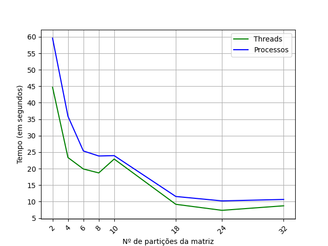

~~~~
Trabalho por Luís Henrique Melo Scalabrin
~~~~
## Etapa 2 - Sequencial VS Paralelo
### A) Qual o motivo dos resultados obtidos no experimento E1?

Gráfico de comparação entre os 3 programas em função do tamanho da matriz

A partir do gráfico acima, podemos analisar 2 comportamentos:

- Os 3 programas não têm grandes diferenças de tempo para matrizes de tamanho até 800x800
- Acima de 800x800, o aumento de tempo para o programa sequencial é exponencialmente maior do que os programas paralelos

Para o último comportamento, é certo que o motivo do ganho de performance nos programas que utilizam threads e processos se deve ao paralelismo deles, já que os elementos da matriz resultante podem ser calculado sem interferências entre eles mesmo, enquanto o programa sequencial deve calcular cada elemento de forma sequencial. 

----------
### B) Qual o motivo dos resultados obtidos no experimento E2?
Gráfico de comparação entre os programas paralelos em função do número de processos/threads

Vemos que o dado o mesmo número de processos e threads para resolver a multiplicação das matrizes, as threads são mais rápidas que os processos. Isso acontece por que a instanciação de uma thread é mais "leve" do que a instaciação de um process, pois a thread tem menos elementos (contador de programa, stack e registradores) do que um processo, que é um cópia do processo original

### C) Qual é o valor de P ideal para a multiplicação das matrizes M1 e M2?

Podemos ver com base no gráfico do experimento B que os programas atingem seus tempos mínimos com um P correspondente ao número de elementos da matriz resultante dividida por 24 (como a matriz é 3200x3200, isso equivale a 426.667 elementos por thread/processo). É possível que a partir deste ponto, aumentar o número de threads/processos não seja mais vantajoso pelo custo computacional da troca de contexto e/ou pelo grande número de threads/processos esperando na fila de escalonamento.